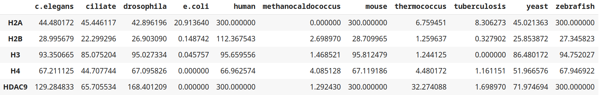

# Проект по биоинформатике

### Был выбран белок HDAC9

В первой статье утверждается, что на участках TSS соответствующих репрессированных генов HDAC9−/− повышает уровень H3K27ac. 
Второе исследование показало, что при гипоксии (недостатке кислорода) увеличивается количество белка HDAC9, что препятствует работе H3K27ac и приводит к подавлению транскрипции OCT2.
Белок HDAC9 входит в состав комплекса HDAC.
Выполняет функцию деацетилирования гистонов и регулирования транскрипции.
Больше всего экспрессируется в лимфатических узлах, мозге и селезенке. 
В своей структуре имеет домен ClassIIa_HDAC_Gln-rich-N.

[1] Di Giorgio E, Dalla E, Franforte E, Paluvai H, Minisini M, Trevisanut M, Picco R, Brancolini C. Different class IIa HDACs repressive complexes regulate specific epigenetic responses related to cell survival in leiomyosarcoma cells. Nucleic Acids Res. 2020 Jan 24;48(2):646-664. doi: 10.1093/nar/gkz1120. PMID: 31754707; PMCID: PMC6954409.

[2] Chen L, Wang Z, Xu Q, Liu Y, Chen L, Guo S, Wang H, Zeng K, Liu J, Zeng S, Yu L. The failure of DAC to induce OCT2 expression and its remission by hemoglobin-based nanocarriers under hypoxia in renal cell carcinoma. Theranostics. 2020 Feb 18;10(8):3562-3578. doi: 10.7150/thno.39944. PMID: 32206108; PMCID: PMC7069078.

Файлы гистонов после выравнивания лежат в папке histones с суффиксом _aligned, без суффикса приведены файлы с выбранными аминокислотными последовательностями.

Таблица e-value:

Таблица с -log e_value:

Полученный хитмап:

Как видно из хитмапа, выбранный белок появился еще до отделения позвоночных и беспозвоночных - сравниваем первые 3 колонки таблицы и следующие 2. Даже с одноклеточными эукариотами есть что-то общее (6-я и 7-я колонки). Однако точно в таком же виде белок представлен только среди позвоночных.
